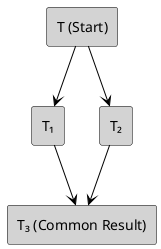

---
{"dg-publish":true,"dg-path":"KSE/Functional Programming/10. The Church-Rosser Theorem.md","permalink":"/kse/functional-programming/10-the-church-rosser-theorem/","tags":["kse"],"created":"2025-02-19T00:32:30.268+02:00","updated":"2025-02-19T00:59:34.793+02:00"}
---

# 10. The Church-Rosser Theorem

---

## The Church-Rosser Theorem (CR Theorem)

The **Church-Rosser Theorem** is a fundamental result in lambda calculus. 

> [!quote] It ensures that:
> If an expression can be reduced in multiple ways, all reduction paths will eventually reach the **same final result**, provided a normal form exists.

---

### Understanding the Church-Rosser Theorem  

Imagine you are **inside a maze with multiple exits**:  

- - You start from a point **$T$**.
- You see **two different paths** to reach a destination:
  - **Path 1:** $T \twoheadrightarrow T_1$  
  - **Path 2:** $T \twoheadrightarrow T_2$  

At first, it might seem like **whichever path you take determines your final destination**. But the **Church-Rosser Theorem** assures us that:  

> _No matter which path you choose, there is always a way to **navigate through the maze** and arrive at the same final destination._  

Formally:  

$$
\text{If } T \twoheadrightarrow T_1 \quad \text{and} \quad T \twoheadrightarrow T_2,  
\quad \text{then there exists } T_3 \quad \text{such that }  
T_1 \twoheadrightarrow T_3 \quad \text{and} \quad T_2 \twoheadrightarrow T_3.
$$  

In other words, even if you take **different routes**, there is always a **common point** inside the maze where the paths reconnect—ensuring that all roads **ultimately lead to the same solution**.

---

### Visual representation of Church-Rosser

The theorem guarantees a **diamond structure** for reductions:

No matter which reduction path you follow, **they will always converge to a common term $T_3$**.

---

## Corollary: Uniqueness of normal forms

A **normal form** is an expression that **cannot be further reduced**—it is **fully simplified**.

> [!important] A key consequence of the Church-Rosser Theorem
> If a lambda term has a normal form, it is **unique**.

This means that no matter **how** we reduce a term, as long as a **normal form exists**, we will always reach the **same result**.

---

### Proof of uniqueness

Suppose that for a given term $T$, there are <strong>two different normal forms</strong>, $N_1$ and $N_2$. The **Church-Rosser Theorem** ensures that:

1. We start from $T$:  
   $$T \twoheadrightarrow N_1 \quad \text{and} \quad T \twoheadrightarrow N_2$$

2. By the **Church-Rosser Theorem**, both paths must join:  
   $$N_1 \twoheadrightarrow N \quad \text{and} \quad N_2 \twoheadrightarrow N$$

3. However, $N_1$ and $N_2$ are normal forms — **they cannot be reduced further** (or changed):  
   $$N_1 = N \quad \text{and} \quad N_2 = N$$

4. This means:  
   $$N_1 = N_2$$

✅ <strong>Conclusion</strong>: If a normal form exists, it is unique!

---
