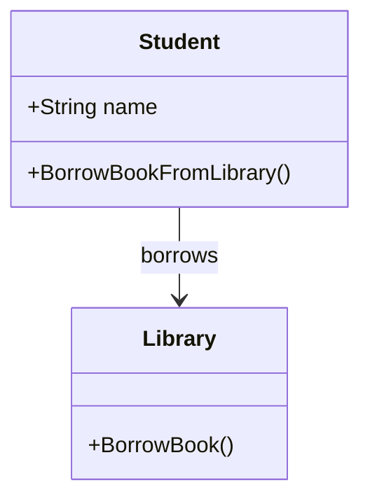
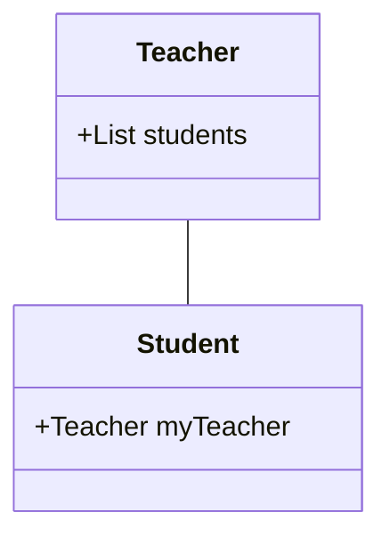
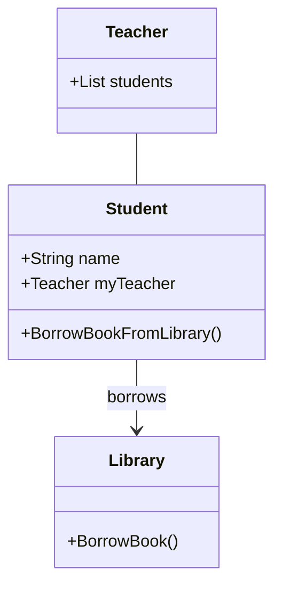
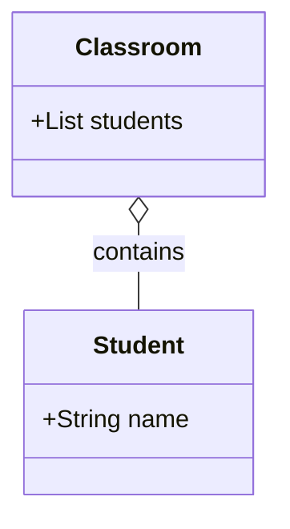
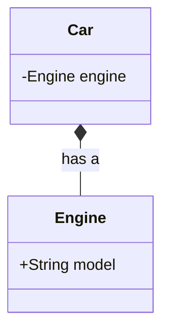
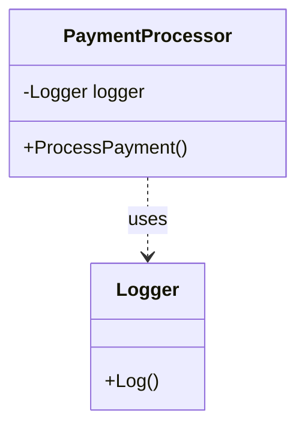
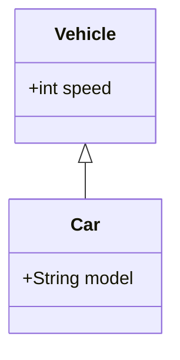
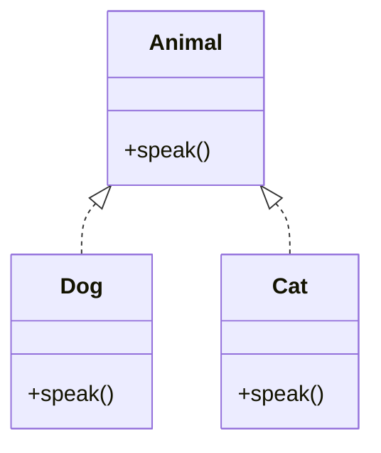
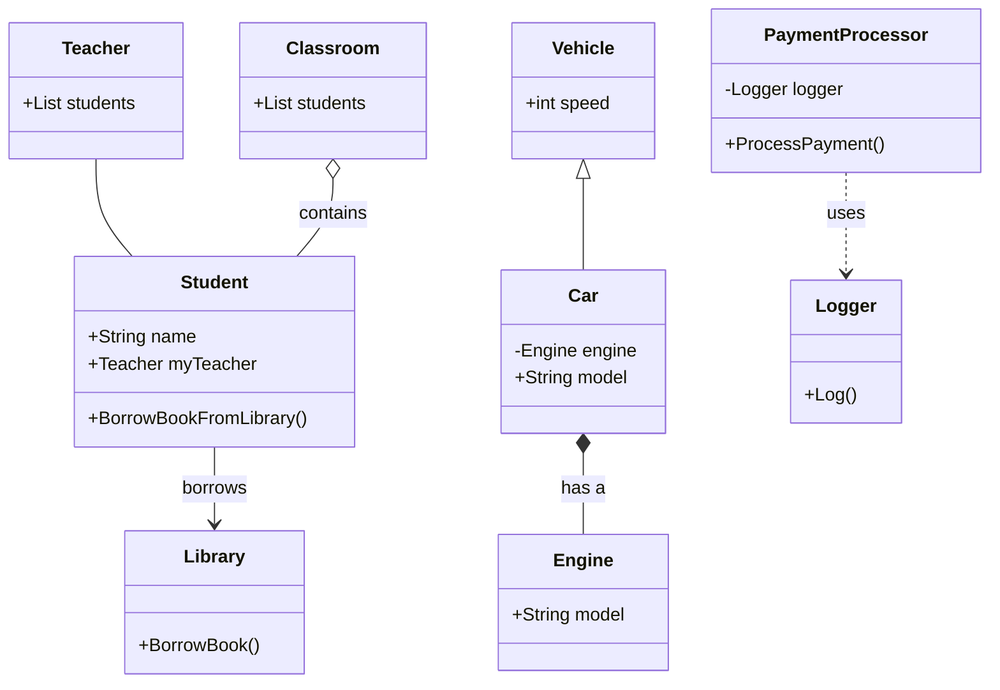

---
{"dg-publish":true,"permalink":"/02-kse/2-5-term/object-oriented-programming-in-net/03-dependency-types/","created":"2025-01-24T00:31:11.125+02:00","updated":"2025-01-31T01:14:28.725+02:00"}
---

# Dependency Types
---

## What is Dependency Types?
---

In object-oriented programming (OOP), **dependency types** define relationships between different **[[02 - KSE/2_5-term/Object-Oriented Programming in .NET/02. Class vs Struct#Introduction to Classes\|classes]]** in a system. These relationships determine how objects **interact** and depend on each other to achieve functionality.


### Types of Dependencies
The main types of dependencies in OOP include:

1. **Association**
2. **Aggregation**
3. **Composition**
4. **Dependency**
5. **Inheritance**
6. **Interface Implementation**

## Association
---

**Definition:**  
Association represents a **"has-a" relationship** between two classes, indicating that one class is related to another in some way.
In other words, it shows how classes are **connected** and interact with each other.

Association can be further classified into two types: Unidirectional and Bidirectional.

### Unidirectional Association:
One class depends on another, but the reverse is not true.

<strong><span style="color: var(--color-green);">Example:</span></strong> A `Library` class can lend books to a `Student` class. The student knows the library, but the library does not know the student.
```csharp
class Library
{
    public void BorrowBook(string bookName)
    {
        Console.WriteLine($"Book '{bookName}' borrowed.");
    }
}

class Student
{
    public string Name { get; set; }

    public void BorrowBookFromLibrary(Library library, string bookName)
    {
        Console.WriteLine($"{Name} borrows book '{bookName}' from the library.");
        library.BorrowBook(bookName);
    }
}

Student student = new Student { Name = "Alice" };
Library library = new Library();
student.BorrowBookFromLibrary(library, "Introduction to C#");
// Output: Alice borrows book 'Introduction to C#' from the library.
//         Book 'Introduction to C#' borrowed.
// So, the student knows the library, but the library does not know the student.
```

In UML, it is represented by a **solid line** with an **arrow** pointing to the class that is being referenced.


### Bidirectional Association:
Both classes are aware of each other and can interact mutually.

<strong><span style="color: var(--color-green);">Example:</span></strong> A `Teacher` class knows their students, and students know their teacher.
```csharp
class Teacher
{
    public List<Student> Students { get; set; }
}

class Student
{
    public Teacher MyTeacher { get; set; }
}

Teacher teacher = new Teacher();
Student student = new Student { MyTeacher = teacher };
teacher.Students = new List<Student> { student };
// Both classes are aware of each other.
```

In UML, it is represented by a **solid line** connecting the classes without arrows.


<strong><span style="color: var(--color-purple);">Metaphor:</span></strong>  
Association can be thought of as a **friendship** where one or both parties know each other.



## Aggregation
---

**Definition:**  
Aggregation is a special type of association where one class is a **collection or container** of other classes, but the contained objects can exist independently.

**Key Characteristics:**
It represents a **weak "has-a" relationship**, meaning that the lifecycle of the contained objects is **not** dependent on the container.

<strong><span style="color: var(--color-green);">Example:</span></strong> A `Classroom` contains multiple `Students`, but students can exist even if the classroom is deleted.
```csharp
class Student
{
    public string Name { get; set; }
}

class Classroom
{
    public List<Student> Students { get; set; } = new List<Student>();
    // new List<Student>() initializes an empty list of students.
}

Classroom classroom = new Classroom();
Student student1 = new Student { Name = "Alice" };
Student student2 = new Student { Name = "Bob" };
classroom.Students.Add(student1);
classroom.Students.Add(student2);

```

<strong><span style="color: var(--color-purple);">Metaphor:</span></strong>  
Aggregation is like a **container and its contents** — the container can hold items, but the items can exist independently.

### Aggregation Characteristics
1. **Independent Lifecycle:**  
   The **Student** objects (`student1` and `student2`) can exist *independently* of the **Classroom** object. If the **Classroom** object is destroyed, the **Student** objects still exist.

2. **Ownership:**  
   The **Classroom** object does not own the **Student** objects. It merely holds **[[02 - KSE/2_5-term/Object-Oriented Programming in .NET/02. Class vs Struct#Key Points\|references]]** to them.
### Visual Representation

Imagine a classroom with students. The classroom can have many students, but the students do not cease to exist if the classroom is no longer there. They can move to another classroom or exist without being part of any classroom.



---

## Composition

**Definition:**  
Composition is a stronger form of aggregation where the contained objects **cannot exist independently** of the container. It's like a vice versa of aggregation.

**Key Characteristics:**
It represents a **strong "owns-a" relationship**, meaning that if the parent object is destroyed, the contained objects are also destroyed.

<strong><span style="color: var(--color-green);">Example:</span></strong> A `Car` contains an `Engine` and `Wheels`. If the car is destroyed, the engine and wheels no longer exist.
```csharp
class Engine
{
    public string Model { get; set; }
}

class Car
{
    private Engine engine;

    public Car()
    {
        engine = new Engine(); // Car cannot exist without an engine.
    }
    // if the car is destroyed, the engine is also destroyed.
}
```

<strong><span style="color: var(--color-purple);">Metaphor:</span></strong>  
Composition is like a **human body and its organs** — if the body stops to exist, so do the organs.



`-Engine engine` means that the engine is a **private** member of the Car class, indicating

## Dependency
---

**Definition:**  
Dependency occurs when one class relies on another class for some functionality. This is often represented as a method parameter or local variable.

**Key Characteristics:**
Represents a **"uses-a" relationship**, meaning one class **depends** on another but does not own it.

<strong><span style="color: var(--color-green);">Example:</span></strong> A `PaymentProcessor` class depends on a `Logger` class to log transactions.
```csharp
class Logger
{
    public void Log(string message)
    {
        Console.WriteLine(message);
    }
}

class PaymentProcessor
{
    private Logger logger = new Logger(); // PaymentProcessor uses Logger.

    public void ProcessPayment()
    {
        logger.Log("Payment processed."); // here is the dependency
    }
}
```

<strong><span style="color: var(--color-purple);">Metaphor:</span></strong>  
Dependency is like a **chef using kitchen appliances** — the chef depends on them to prepare meals, but they exist separately.



### The diffirence between Composition and Dependency

**Composition:** This is a stronger relationship where one class owns an instance of another class. The composed class is responsible for the lifecycle of the instance it owns. This is often represented as a member variable.

**Dependency:** This occurs when a class relies on another class to perform a certain function. The dependent class does not own the instance of the other class; it simply uses it temporarily. This is often represented as a method parameter or a local variable.

```csharp
// Dependency
public class Engine
{
    public void Start() { /*...*/ }
}

public class Car
{
    // we pass the Engine instance as a parameter
    public void StartCar(Engine engine)
    {
        // we use the Engine instance
        engine.Start();
    }
}
```
In this example, `Car` has a dependency on `Engine` because it uses an `Engine` instance passed as a parameter to the `StartCar` method.

```csharp
// Composition
public class Engine
{
    public void Start() { /*...*/ }
}

public class Car
{
    private Engine _engine;

    public Car()
    {
        // we create an instance of Engine within the Car class (`new` keyword!)
        _engine = new Engine();
    }

    public void StartCar()
    {
        _engine.Start();
    }
}
```
In this example, `Car` is composed of an `Engine` because it owns an instance of `Engine` and is responsible for its lifecycle.

Basically, the key difference is that in **Composition**, the class owns the instance of another class, while in **Dependency**, the class uses the instance of another class without owning it. 

In **Dependency**, we DO NOT use the `new` keyword to create an instance of the class, but in **Composition**, we do. 

So, in **Dependency**, we use a reference to the instance of the class, while in **Composition**, we use the instance itself.

## Inheritance
---

**Definition:**  
[[02 - KSE/2_5-term/Object-Oriented Programming in .NET/01. Intro to OOP#Inheritance\|Inheritance]] is a dependency type where one class (child) derives from another class (parent), inheriting its properties and behavior.

**Key Characteristics:**
Enables code reuse and establishes an **"is-a" relationship**.

<strong><span style="color: var(--color-green);">Example:</span></strong> A `Car` class can inherit from a `Vehicle` class, gaining common attributes such as speed and fuel.
```csharp
class Vehicle
{
    public int Speed { get; set; }
}

class Car : Vehicle
{
    public string Model { get; set; }
}
```

<strong><span style="color: var(--color-purple);">Metaphor:</span></strong>  
Inheritance is like a **child inheriting traits from their parents**, sharing common characteristics while having unique ones.



## Interface Implementation
---

**Definition:**  
An interface defines a contract that a class must follow, ensuring it implements specific methods. In C++, this is similar to **pure virtual functions** or **abstract classes**. 

Abstract classes (interfaces) define the **"what"** (method signatures), and concrete classes define the **"how"** (method implementations). The abstract class (interface) CANNOT exist on its own; it needs concrete classes to implement it.

**Key Characteristics:**
Promotes code **decoupling**, allowing different classes to implement the same behavior differently.

<strong><span style="color: var(--color-green);">Example:</span></strong> A `Dog` and `Cat` class can implement the same `IAnimal` interface but provide different implementations.
```csharp
interface IAnimal
{
    void Speak();
}

class Dog : IAnimal
{
    public void Speak() => Console.WriteLine("Bark");
}

class Cat : IAnimal
{
    public void Speak() => Console.WriteLine("Meow");
}

IAnimal animal = new IAanimal(); // Error: Cannot create an instance of an interface.
IAnimal dog = new Dog(); // OK
dog.Speak(); // Output: Bark
```

Metaphor: 
Interfaces are like **job contracts** — different people (classes) follow the same contract but perform tasks in their own way.



## Mermaid Diagrams




