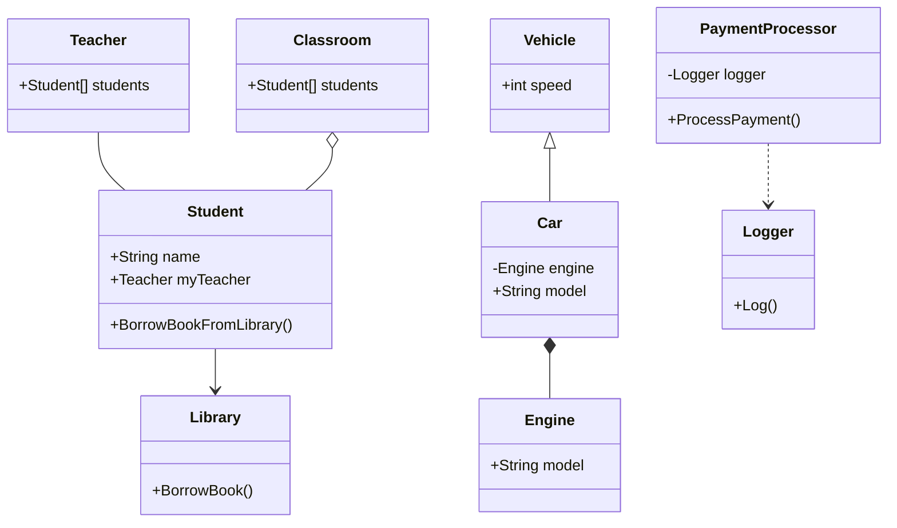
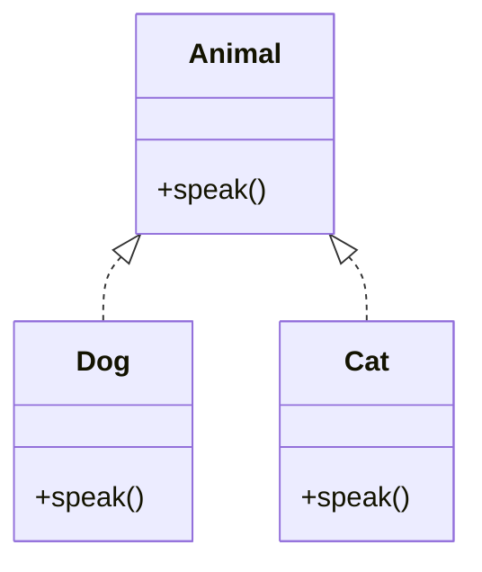

---
{"dg-publish":true,"permalink":"/hello/","created":"2025-01-31T22:24:55.224+02:00","updated":"2025-01-31T23:28:04.163+02:00"}
---

# hello
---

## Mermaid Diagrams

```mermaid
classDiagram
    Student --> Library
    Teacher -- Student
    Classroom o-- Student
    Car *-- Engine
    PaymentProcessor ..> Logger
    Vehicle <|-- Car

    class Student{
        +String name
        +BorrowBookFromLibrary()
        +Teacher myTeacher
    }
    class Classroom{
        +Student[] students
    }
    class Library{
        +BorrowBook()
    }
    class Teacher{
        +Student[] students
    }
    class Engine{
        +String model
    }
    class Car{
        -Engine engine
        +String model
    }
    class Logger{
        +Log()
    }
    class PaymentProcessor{
        -Logger logger
        +ProcessPayment()
    }
    class Vehicle{
        +int speed
    }
```

```mermaid
classDiagram
    Animal <|.. Dog
    Animal <|.. Cat

    class Animal{
        +speak()
    }
    class Dog{
        +speak()
    }
    class Cat{
        +speak()
    }
```
